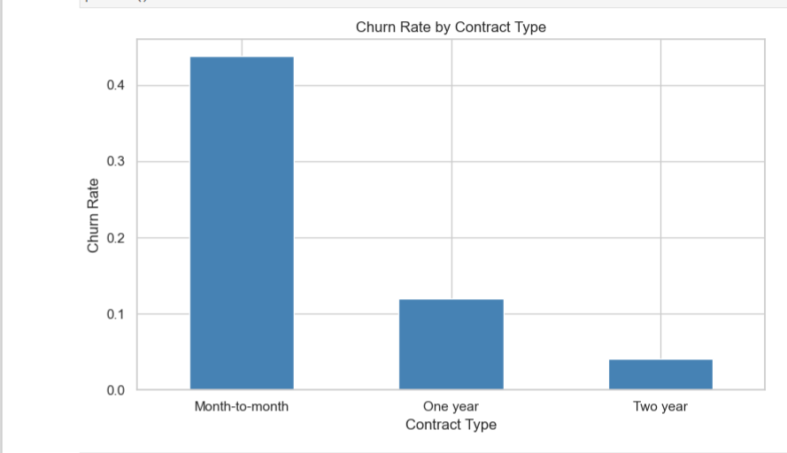
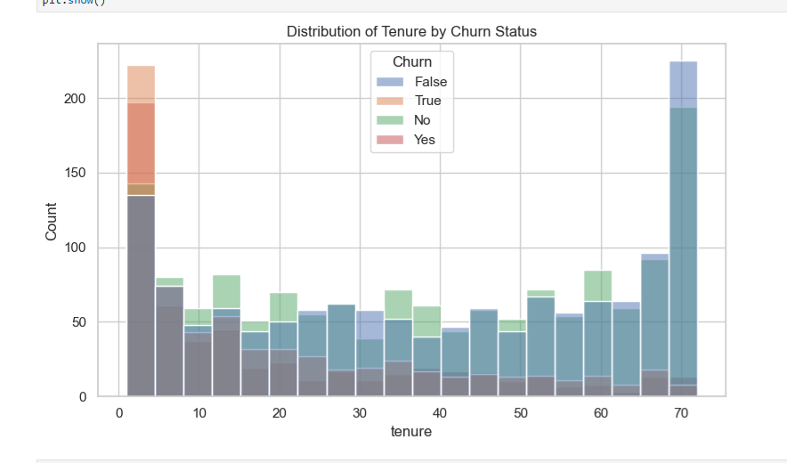
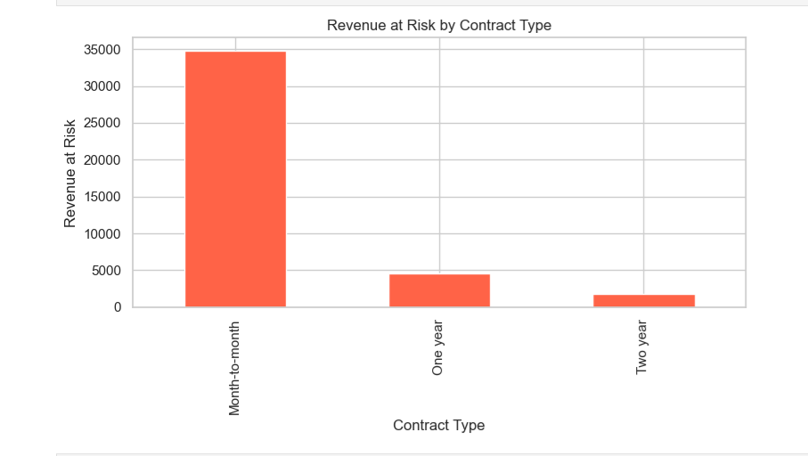

# customer-churn-analysis
End-to-end Python analytics project analysing customer churn behaviour to identify key drivers of attrition and revenue risk, with actionable insights for improving retention and business performance.

# Customer Churn Analysis 📊

## Overview
This project analyses customer churn patterns in a telecom-style dataset to identify key drivers of customer attrition and potential revenue loss. By exploring behavioural and contractual factors such as tenure, contract type, and pricing, the analysis uncovers actionable insights to improve retention strategies and reduce financial risk.

This project demonstrates how Python-based analysis can support data-driven decision-making in a customer-centric business environment.

---

## Business / Analytical Questions
This project answers four key business questions:

1. What factors drive customer churn?  
2. Which customer segments are most at risk of leaving?  
3. How does churn impact revenue?  
4. What actions can the business take to reduce churn?  

---

## Dataset
- Source: Customer churn dataset (CSV)
- Granularity: Customer-level data  

The dataset contains the following key features:
- Tenure  
- Monthly Charges  
- Contract Type (Month-to-month, One-year, Two-year)  
- Churn Status (Yes/No)  

---

## Tools Used
- Python (Pandas, NumPy)  
- Matplotlib / Seaborn  
- Jupyter Notebook  
- Git & GitHub  

---

## Technical Methods Used
- Data cleaning and standardisation  
- Exploratory Data Analysis (EDA)  
- Feature engineering (`churn_flag`)  
- Aggregation and grouping  
- Data visualisation  

---

## Process (What I Did)
- Cleaned dataset by handling missing values and standardising churn labels  
- Conducted EDA to identify churn patterns  
- Analysed customer behaviour by:
  - contract type  
  - tenure  
  - monthly charges  
- Calculated revenue at risk  
- Built visualisations to communicate insights  

---

## Key Visualisations

### Monthly Charges by Churn Status
[Monthly Charges by Churn](visuals/monthly_charges_by_churn.png)

**Insight:** Customers who churn occupy more of the higher-charge range (up to ~120), suggesting that higher-paying customers are more price-sensitive and at greater risk of leaving.

---

### Churn Rate by Contract Type

**Insight:** Month-to-month customers have the highest churn rate (~40%+), compared to ~10% (one-year) and ~5% (two-year), making contract duration the strongest driver of customer retention.

---

### Distribution of Tenure by Churn Status

**Insight:** Most churn occurs within the first 0–10 months, indicating that early customer lifecycle engagement is critical for reducing churn.

---

### Revenue at Risk by Contract Type

**Insight:** Month-to-month customers account for the highest revenue at risk (~30k+), while long-term contracts contribute minimal churn-related revenue losses.

---

## Key Insights
- Contract type is the strongest driver of churn  
- Customers without long-term commitment are more likely to churn  
- Early customer lifecycle is critical (first few months)  
- Higher-paying customers tend to churn more  
- Revenue risk is concentrated in month-to-month customers  

---

## Business Implications
This analysis supports key business decisions:

- Focus retention strategies on month-to-month customers  
- Improve onboarding experience within the first 90 days  
- Evaluate pricing and perceived value  
- Encourage customers to switch to long-term contracts  

👉 Reducing churn in high-risk segments can significantly improve revenue stability.

---

## Challenges and Solutions
- **Inconsistent data labels:** Standardised values (Yes/No vs True/False)  
- **Noisy or duplicate features:** Cleaned and consolidated relevant columns  
- **Visual interpretation challenges:** Used multiple chart types for clarity  

---

## What I Would Improve Next
- Build a predictive churn model (Logistic Regression / XGBoost)  
- Perform feature importance analysis  
- Add customer segmentation (clustering)  
- Create an interactive dashboard (Power BI / Cognos)  
- Include time-based churn trend analysis  

---

Conclusion
This project demonstrates how Python-based exploratory analysis can transform customer-level data into actionable retention insights. It proves practical ability in data cleaning, visual storytelling, churn analysis, and recommendation writing.

---

## Project Structure
customer-churn-analysis/
│
├── data/
│   └── churn_data.csv
├── notebooks/
│   └── churn_analysis.ipynb
├── visuals/
│   ├── monthly_charges_by_churn.png
│   ├── churn_rate_by_contract.png
│   ├── churn_by_tenure.png
│   └── revenue_at_risk.png
└── README.md

---
